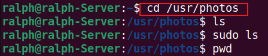

# Basic_Linux_Command

## 1. What is a Linux Command?

A Linux command is an instruction that you input into the Linux terminal to perform a specific task. It typically consists of:

- Command Name: The main instruction (e.g., ls, cd, pwd).

- Option or Flag: Additional options to modify behavior (e.g. ls -a, where -a is a flag).

- Parameter or Argument: The target (e.g., cd /home/user, /home/user is the argument).

_**Note**: Linux is case-sensitive. CD and cd are different commands._

## Manipulating files and directories on Linux

Most of your time on Linux will be working with files and directories. Hence, it is very important to know how to work with them. In the next section, we will focus on different commands that covers different use cases of manipulating files and directories on linux.

The `sudo` command

In Linux, some actions need special permission to be carried out, like creating files in certain areas or changing important system settings. This is where the sudo command comes into play. "sudo" stands for "superuser do," and it allows you to run commands with the security privileges of another user, typically the superuser or "root."

### Creating a Folder with sudo:

Sometimes, you need superuser privileges to create a folder in certain locations on your system. Here's how you can do it:

1. Open your terminal, and connect to your linux server using SSH.

2. Try creating a folder in a restricted location. For example, let's try to create a folder named **"example"** in the `/root` directory, which is reserved for the root user:

`mkdir /root/example`

3. Observe the failure. You'll likely encounter a permission denied error like this:

This error occurs because regular users do not have the necessary permissions to create directories in /root.

4. Use sudo to Successfully Create the Folder

`sudo mkdir /root/example`

**Press Enter:** Because you now included `sudo` in the command. It executes successfully without error. In some cases, you may be prompted to provide a password. If it does, and you know the password, simply provide it and the elevated permission will be used to create the folder.

**Verify the folder's creation:** The command should succeed without errors. You can check the folder's existence by listing the contents of `/root` using the `ls` command. It should include the newly created folder in the output on your screen. Though you may need to use sudo again to view the contents of this directory:

`sudo ls /root`

**Note:** Using `sudo` gives you significant power over your system, including the ability to change or delete crucial system files. So, it's wise to use it carefully and only when necessary.

pwd command

Use the `pwd` command to find the path of your current working directory. Simply entering `pwd` will return the full current path – a path of all the directories that starts with a forward slash (/). For example, `/home/username`.

The pwd command uses the following syntax:

``pwd
/Users/dareyio/Desktop
``

The Linux directory structure.

After learning about the use of sudo, it's crucial to understand how the Linux filesystem is organized. This knowledge is fundamental when navigating through the system, managing files, and understanding where different types of files and directories reside.

The Root Directory ("/")

To list the files and directories on in the root filesystem, simply type `sudo ls -l`.

Below is my output, but yours may be slightly different

## Side Hustle Task 1 :

- Create a directory called photos inside the /usr directory

- navigate into the photos directory

- Create 3 more random directories inside the photos directory

- Show the newly created directories on the terminal

- Navigate into one of them

- Show the full path where you currently are on the screen

